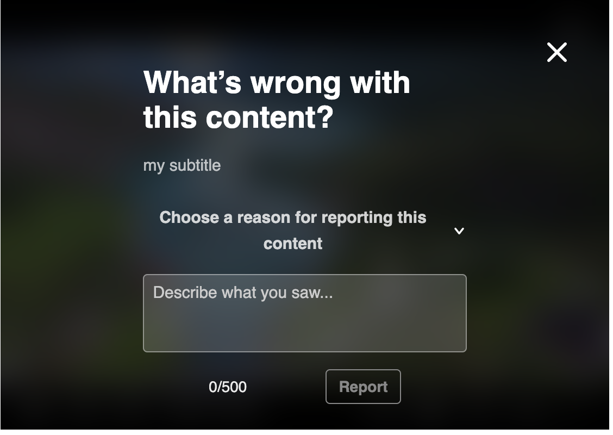
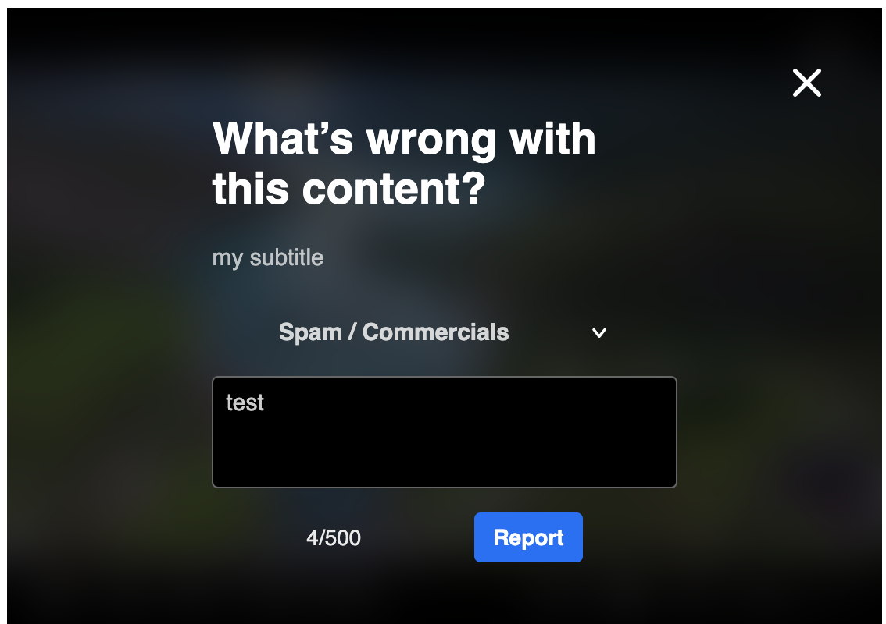

# PlayKit JS Moderation - plugin for the [PlayKit JS Player]

[](https://github.com/kaltura/playkit-js-moderation/actions/workflows/run_canary_full_flow.yaml)
[](https://github.com/prettier/prettier)
[](https://www.npmjs.com/package/@playkit-js/moderation)
[](https://www.npmjs.com/package/@playkit-js/moderation/v/canary)

### About

Moderation plugin provides applications ability to add reporting mechanisem for the content that being played in case users find it not appropriate.

PlayKit JS Moderation is written in [ECMAScript6], statically analysed using [Typescript] and transpiled in ECMAScript5 using [Babel].

[typescript]: https://www.typescriptlang.org/
[ecmascript6]: https://github.com/ericdouglas/ES6-Learning#articles--tutorials
[babel]: https://babeljs.io

## Getting Started

### Prerequisites

The plugin requires [Kaltura Player] to be loaded first.

[kaltura player]: https://github.com/kaltura/kaltura-player-js

### Installing

First, clone and run [yarn] to install dependencies:

[yarn]: https://yarnpkg.com/lang/en/

```
git clone https://github.com/kaltura/playkit-js-moderation.git
cd playkit-js-moderation
yarn install
```

### Building

Then, build the plugin

```javascript
yarn run build
```

### Testing

The plugin uses `cypress` tool for e2e tests

```javascript
yarn run test
```

UI conf file (`cypress/public/ui-conf.js`) contains Kaltura player and plugin dependencies.
Keep Kaltura player and dependency versions aligned to currently released versions.

### Embed the library in your test page

Finally, add the bundle as a script tag in your page, and initialize the player

```html
<script type="text/javascript" src="/PATH/TO/FILE/kaltura-player.js"></script>
<!--Kaltura player-->
<script type="text/javascript" src="/PATH/TO/FILE/playkit-moderation.js"></script>
<!--PlayKit moderation plugin-->
<div id="player-placeholder" style="height:360px; width:640px">
  <script type="text/javascript">
    var playerContainer = document.querySelector("#player-placeholder");
    var config = {
     ...
     targetId: 'player-placeholder',
     plugins: {
       'playkit-js-moderation': { ... }
     }
     ...
    };
    var player = KalturaPlayer.setup(config);
    player.loadMedia(...);
  </script>
</div>
```

## Documentation

Moderation plugin configuration can been found here:

- **[Configuration](#configuration)**

## Contributing

Please read [CONTRIBUTING.md](https://gist.github.com/PurpleBooth/b24679402957c63ec426) for details on our code of conduct, and the process for submitting pull requests to us.

## Versioning

We use [SemVer](http://semver.org/) for versioning. For the versions available, see the [tags on this repository](https://github.com/kaltura/playkit-js-moderation/tags).

## License

This project is licensed under the AGPL-3.0 License - see the [LICENSE.md](LICENSE.md) file for details

<a name="configuration"></a>
## Configuration

#### Configuration Structure

```js

//Plugin params
"playkit-js-moderation": {
  reportLength?: number, // optional
  subtitle?: string, // optional extra information to be displayed
  notificatonDuration?: number, // miliseconds, optional
  moderateOptions?: Array< {id: number, label: string} > // optional
}
```
#### Plugin Default configuration

"playkit-js-moderation" = {};

```
"playkit-js-moderation": {
    "reportLength": 500,
    "subtitle": "",
    "notificatonDuration": 5000,
    "moderateOptions": [
      {
      		"id": 1,
      		"label": "Sexual Content"
      },
      {
      		"id": 2,
      		"label": "Violent Or Repulsive"
      },
      {
      		"id": 3,
      		"label": 'Harmful Or Dangerous Act"
      },
      {
      		"id": 4,
      		"label": "Spam / Commercials"
      },
      {
	       "id": 5,
	       "label": "Copyright Violation"
      },
      {
      		"id": 6,
      		"label": "Terms of Use Violation"
      }
    ]
  }
```

### Example:







## Docs:

> ### config.reportLength
>
> ##### Type: `number`
>
> ##### Default: `500`
>

##

> ### config.subtitle
>
> ##### Type: `string`
>
> ##### Default: `-`
>

##

> ### config.notificatonDuration
>
> ##### Type: `number`
>
> ##### Default: `5000`
>

##

> ### config.moderateOptions
>
> ##### Type: `Array< {id: number, label: string} >`
>
> ##### Default: 
```js
moderateOptions = [
  {id: 1, label: 'Sexual Content'},      
  {id: 2, label: 'Violent Or Repulsive'},      
  {id: 3, label: 'Harmful Or Dangerous Act'},      
  {id: 4, label: 'Spam / Commercials'}
]
```
>
